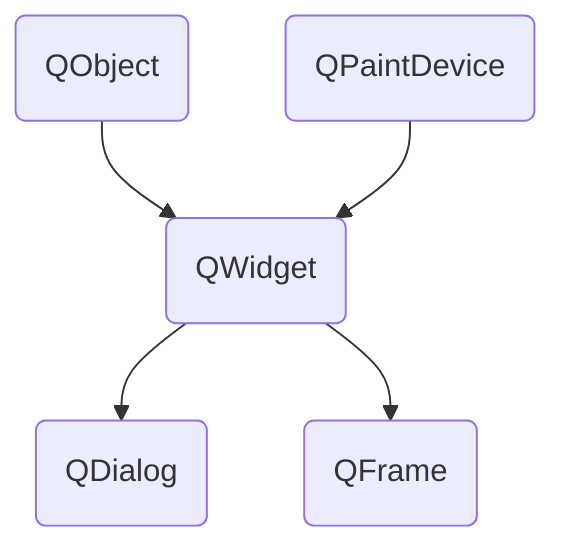
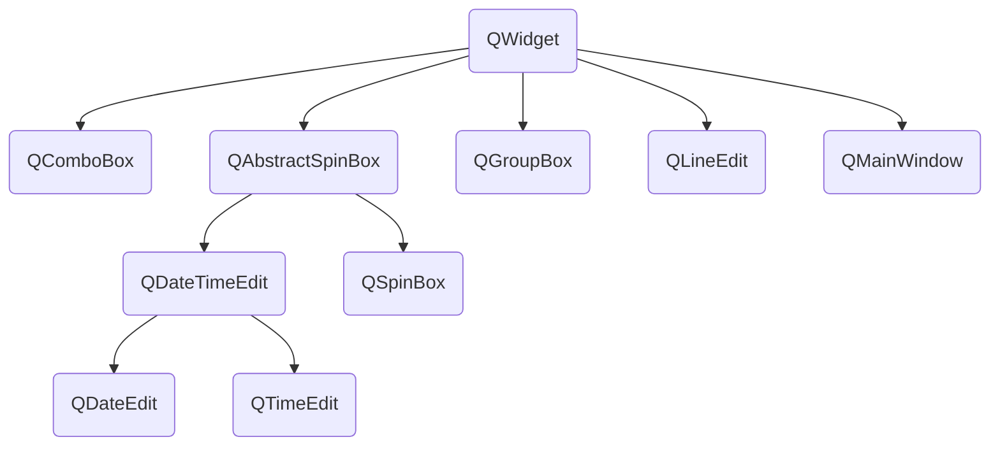
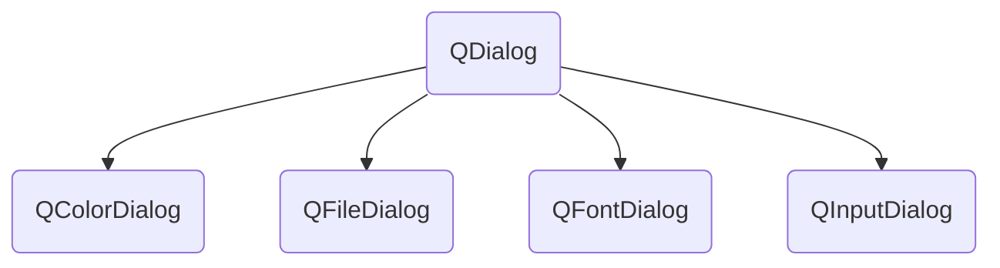
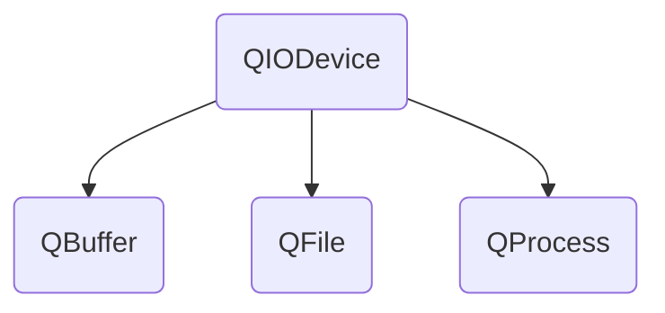
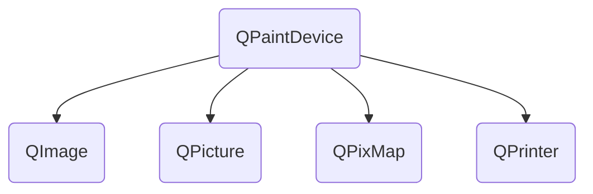

PyQt API is a large collection of classes and methods. These classes are defined in more than
20 modules. Following are some of the frequently used modules:

| Qt Module | Description
|-----------|-------------
| QtCore | Core non-GUI classes used by other modules
| QtGui | Graphical user interface components
| QtMultimedia | Classes for low-level multimedia programming
| QtNetwork | Classes for network programming
| QtOpenGL | OpenGL support classes
| QtScript | Classes for evaluating Qt Scripts
| QtSql | Classes for database integration using SQL
| QtSvg | Classes for displaying the contents of SVG files
| QtWebKit | Classes for rendering and editing HTML
| QtXml | Classes for handling XML
| QtAssistant | Support for online help
| QtDesigner | Classes for extending Qt Designer

<em>PyQt API contains more than 400 classes</em>. The QObject class is at the top of class hierarchy. It
is the base class of all Qt objects. Additionally, QPaintDevice class is the base class for all
objects that can be painted.

<em>QApplication</em> class manages the main settings and control flow of a GUI application. It
contains main event loop inside which events generated by window elements and other
sources are processed and dispatched. It also handles system-wide and application-wide
settings.

<em>QWidget</em> class, derived from QObject and QPaintDevice classes is the base class for all user
interface objects. QDialog and QFrame classes are also derived from QWidget class. They
have their own sub-class system.
Following diagrams depict some important classes in their hierarchy.

<em>Here is a select list of frequently used widgets:</em>

### Qt Widgets

| Widget | Description |
| --- | --- |
| QLabel | Used to display text or image |
| QLineEdit | Allows the user to enter one line of text |
| QTextEdit | Allows the user to enter multi-line text |
| QPushButton | A command button to invoke action |
| QRadioButton | Enables to choose one from multiple options |
| QCheckBox | Enables choice of more than one options |
| QSpinBox | Enables to increase/decrease an integer value |
| QScrollBar | Enables to access contents of a widget beyond display aperture |
| QSlider | Enables to change the bound value linearly. |
| QComboBox | Provides a dropdown list of items to select from |
| QMenuBar | Horizontal bar holding QMenu objects |
| QStatusBar | Usually at bottom of QMainWindow, provides status information. |
| QToolBar | Usually at top of QMainWindow or floating. Contains action buttons |
| QListView | Provides a selectable list of items in ListMode or IconMode |
| QPixmap | Off-screen image representation for display on QLabel or QPushButton object |
| QDialog | Modal or modeless window which can be used for many purposes |